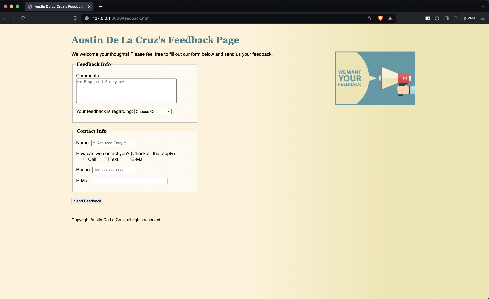
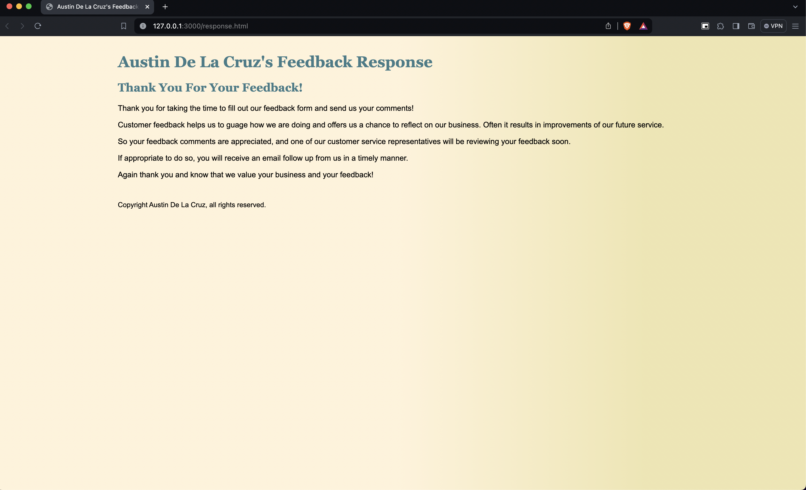

# Feedback and Response Form

Feedback and Response Form using HTML and CSS 
This page demonstrates text area, placeholder attribute, pattern attribute, required attribute, option selected attribute, and method attribute.

